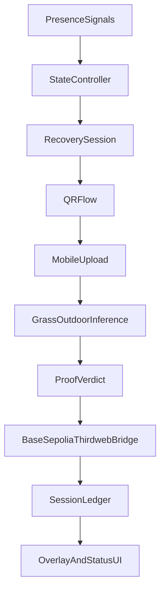

# Screen Recovery + On-Chain Proof Plan

## Current Baseline

You already have the core primitives in one file: live presence scoring, QR upload server, and grass/outdoor proof inference in `[/Users/krishnatrehan/00000UNI/hackathon2/camera_tracking.py](/Users/krishnatrehan/00000UNI/hackathon2/camera_tracking.py)`. The current flow is event-based (`look_hold -> prompt -> challenge_active -> upload verdict`) and can be upgraded into explicit states without a rewrite.

## Target Architecture (Single Process)

- Keep one Python runtime in `[/Users/krishnatrehan/00000UNI/hackathon2/camera_tracking.py](/Users/krishnatrehan/00000UNI/hackathon2/camera_tracking.py)`.
- Add an internal finite-state controller (`ONLINE`, `WARNING`, `DECAY`, `RECOVERY_REQUIRED`, `OUTSIDE_MODE`, `PROOF_VERIFIED`, `MINTED`).
- Extend existing Flask app (`create_upload_app`) to hold recovery session records and proof metadata.
- Add NFT bridge hooks that call Base Sepolia mint/update endpoints (thirdweb) from Python after proof verification.
- Add a dedicated `--demo-mode` runtime profile that prioritizes reliability, clear UI states, and deterministic timings for judge demos.

## Implementation Steps

1. **State model + transitions**
  - Introduce enums/dataclasses for lifecycle states and transition guards (look duration, cooldown, challenge timeout, absence timeout).
  - Replace ad-hoc booleans (`prompt_visible`, `challenge_active`, timers) with one transition function called each frame.
2. **Recovery session object**
  - Create a `RecoverySession` record containing session_id, started_at, user_present_at_start, left_screen_at, upload_count, proof_status, proof_scores, and nft_tx_hash.
  - Generate session-scoped QR URL (`/session/<id>`) instead of one static upload endpoint.
3. **Exit verification hardening**
  - On session start, require `face_detected=True` to arm challenge.
  - Require a minimum continuous absence window before accepting upload proof (`outside_mode` gate).
4. **Mobile upload route upgrade**
  - Add session-aware upload endpoints and bind uploads to active session IDs.
  - Keep capture-only input (`accept=image/`* + `capture=environment`) and add proof details in response payload.
5. **Proof verdict + score persistence**
  - Persist best verified scores for each session and keep a running behavior ledger (JSON file for hackathon speed).
  - Compute value metrics (`outdoor_sessions`, `streak_days`, `decay_penalties`, `score_value`).
6. **Base Sepolia mint/update integration (thirdweb)**
  - Add minimal bridge layer (HTTP calls or subprocess script) for:
    - initial mint after first verified recovery
    - metadata updates after subsequent sessions
  - Store token_id + tx hashes in local ledger.
7. **Overlay/UX updates for demo path**
  - Update debug overlay text to explicit state labels and transition reason.
  - Show judge-friendly sequence: state decay -> recovery required -> QR session active -> proof accepted -> NFT tx + updated value.
8. **Configuration + safety flags**
  - Add CLI flags for strictness (`--min-absence-seconds`, `--session-timeout`, `--mint-enabled`).
  - Add mock chain mode fallback for offline demos (same UX, no chain write).
9. **Demo reliability layer (judge-proofing)**
  - Add one-command start (`python camera_tracking.py --demo-mode`) with tuned defaults (shorter decay window, stable cooldowns, preflight checks).
  - Add visible fallback badges in UI: `CHAIN_LIVE`, `CHAIN_RETRYING`, `CHAIN_FALLBACK_LOCAL_LEDGER`.
  - Cache the latest successful NFT metadata/tx locally so demo still resolves if RPC slows.
  - Add a built-in guided demo script overlay (step 1..N prompts) for a smooth 60-90 second pitch flow.

## Primary Files

- Core changes in `[/Users/krishnatrehan/00000UNI/hackathon2/camera_tracking.py](/Users/krishnatrehan/00000UNI/hackathon2/camera_tracking.py)`
- Dependency updates in `[/Users/krishnatrehan/00000UNI/hackathon2/requirements.txt](/Users/krishnatrehan/00000UNI/hackathon2/requirements.txt)`
- Add local ledger file at `[/Users/krishnatrehan/00000UNI/hackathon2/data/recovery_ledger.json](/Users/krishnatrehan/00000UNI/hackathon2/data/recovery_ledger.json)` (created during implementation)

## Suggested Build Order (Execution)

- State controller
- Sessionized QR/upload routes
- Exit verification gates
- Proof ledger + value engine
- Base Sepolia mint + metadata updates
- Overlay polish + demo script
- Demo-mode hardening + fallback verification

## Judge Demo Acceptance Criteria

- Start app and reach `ONLINE` within 5 seconds on stage hardware.
- Trigger `RECOVERY_REQUIRED` predictably in demo window (no long waits).
- Complete QR upload and get proof verdict in one attempt under normal lighting.
- Show a visible token/tx outcome even if chain RPC is flaky (live or fallback clearly labeled).
- End with a single screen that shows: session result, token ownership reference, and updated value score.

